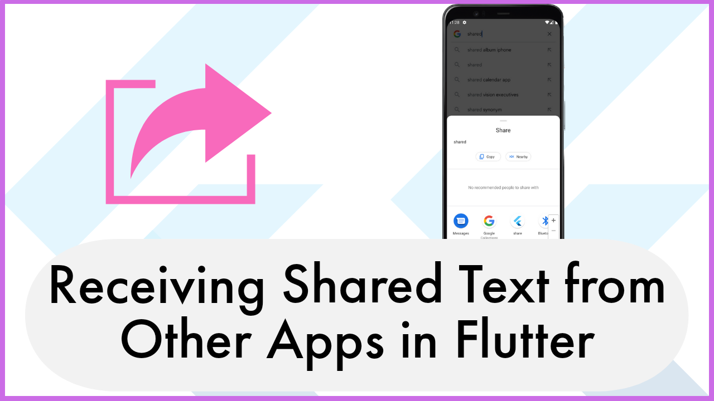

# Receiving Shared Text from Other Apps in Flutter
Flutter is a powerful framework, and with the right techniques, you can harness its capabilities beyond just UI design. [This tutorial](https://youtu.be/J8LIKet5O2E) focuses on how to set up your Flutter app to receive and process shared text from other applications on both Android and iOS devices.

[watch this video](https://youtu.be/J8LIKet5O2E)
